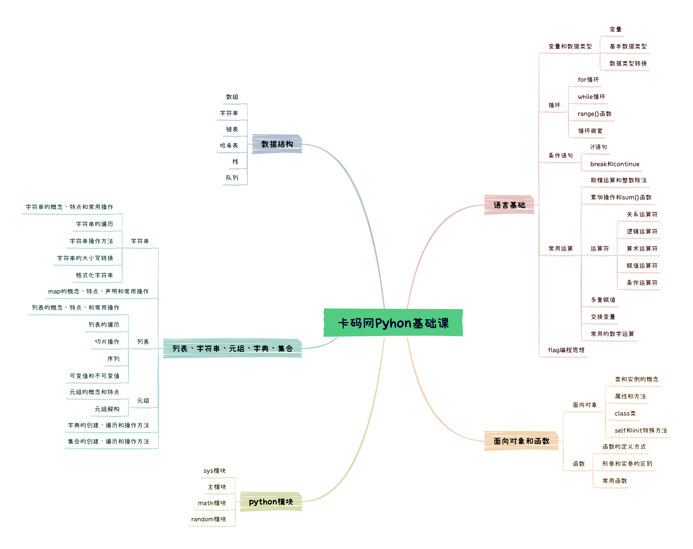

### 前言

[官方文档](https://docs.python.org/zh-cn/3/tutorial/index.html)

Python基础包含：

- 数据结构：列表字符串，元组，字典，集合等
- 语言基础：变量，循环，运算，条件等
- 面向对象和函数等



新建文件hello_world.py，修改hello-world.py，内容如下

```
print("Hello, World!")
```

可以通过两种方式执行脚本，一种是点击运行，一种是命令行的形式：

```python
python "z:\dl_projects\python_self_learn\test.py"
Hello, World!
```

```
>>> import builtins
>>> dir(builtins)
```

### 数据类型

#### 字符串

多行字符串：`"""`或者`'''`表示

```
print("""hello 
world""")
```

字符串拼接

```
print("hello" + ' ' + 'world')
print("hello " * 10)
```

格式化字符串字面值：在字符串前面加一个`f` 或者`F`，就可以在内部用`{}`引用其值

```
score = 100
name = 'Li'
print(f"Name: {name}, score: {score}")
```

还可以用`format`来进行格式化

```
print("Name: {name}, Score: {score}".format(name='Li', score=100))
```

字符串支持切片，但是不可变

`join` 是一个高效的字符串拼接方法，用于将可迭代的对象，列表，元组中的多个字符串元素合并成一个字符串，并通过指定分隔符连接它们

```python
chars = ['a', 'p', 'p']
res = "".join(chars) # app
res = "+".join(chars) # a+p+p
```


#### number

- 整数，没有位数之分，就是int
- 浮点数，小数通过引入decimal表示
- 布尔，True/False，大写
- 复数，cplx = 1+2j，cplx.real，cplx.imag分别返回实虚部
- 10//3地板除，10%3余数

#### 列表list

是最常用的内置结构，可以不包含不同的数据类型

- 可以存储不同的数据类型
- 数据元素可改变
- 索引访问
- 可迭代

```python
my_list = [1,2,3,"hello"]
my_list[0] = "world"
my_list.append(100)
my_list.remove(2)
for item in my_list:
    print(item)
print(my_list[0:2]) # 前两个，左闭右开
my_list.insert(1,2) #在下标1 插入2
```

对于经常用到的赋值和copy

```python
x = [1,50,100]
y = x
x[1] = 0
print(x)
print(y)
print(y is x)
x.pop()
# 这种赋值是创建了一个新的引用而已，变一个另一个跟着变
z = x.copy()
print(z is x)
x[1] = 100
print(x,z)
#浅copy创建新对象，但是数据并不独立

x = [[1,3,4],[4,5,6]]
y = copy.deepcopy(x)
x[1][1] = 100
print(x)
print(y) # 深度copy完全独立了，y不会随着x变化

```

#### 数组

python 数组需要array模块或者引入依赖numpy实现，主要是存储同类型数据，也是可以遍历改变的，支持索引访问

```python
import array

# 创建一个只包含整数的数组
int_array = array.array('i', [1, 2, 3, 4])
print(int_array)
for item in int_array:
    print(item)
    
array('i', [1, 2, 3, 4])
```


```python
import numpy as np
arr1 = np.zeros(5)
arr1 = np.arange(16).reshape(4,4)
print(arr1.size)
print(arr1.shape)
print(type(arr1))
16
(4, 4)
<class 'numpy.ndarray'>
```


#### 元组 tuple

- 不可变，支持切片
- 可迭代，解包机制

```python
a = (1,2,3,"str")
print(a)
# a[0] = 5 # 语法不对，不可修改
#支持切片操作
print(a[::-1])
nums = (3,1,3,4,5,6,3)
print(nums.count(3))
print(nums.index(3))
print(nums * 3)

t = (123,"heros",12.4)
x,y,z = t
print("x:",x,"y:",y,"z:",z)
```

#### 字典

是一种映射关系，里面的每一个元素都由键-值（key-value）构成，如

```python
a = {"Li":95, "zhang":100}
a = dict(li = 95, zhang = 100)
a = dict({"li":95, "zhang":100})

keys = a.keys()
values = a.values()
items = a.items()

a.pop()
del a["li"]
a.clear()

cnt = {}

cnt[cls] = cnt.get(cls, 0) + 1 # 这是字典常用的方法，如果字典不存在，就返回默认值0，不会抛出异常

```

#### 集合Set

集合中的元素都是唯一的，所以可以去重

```python
s = set("fiish")
print(s)
print('f' in s)
```

集合的交并子集操作

```python

s = set("fish")
print(s.isdisjoint("foot")) # 有共同的交集
print(s.issubset(set("fiish.com"))) # 子集
print(s.issuperset(set("fi"))) # 超集
print(s.union({1,2,3})) # 
print(s.union("fi")) # 
print(s.difference("fi"))
# 还可以利用《 + - |这种去对set进行操作
print(s <= set("fich"))
```

总结：字符串列表和元组有很多共同点

1. 可以通过索引获取元素
2. 可切片
3. 有很多共同的运算符

但是只有列表是可修改的，其余两个都不可修改

### 循环

在循环中 `range(5)`本身生成的就是0-4的了，不用再减去1了

### 函数function

位置参数：位置固定，必须按照顺序传递

收集参数：

```
def func(*args): # 通过星号将多个参数打包为元组
	print(len(args))
	print(type(args))
func("hello", "world")

def func(**kwargs): # **将参数打包为字典形式
	print(kwargs)
func(a = 1, b = 2)
```

函数作用域规则：LEGB法则，查找变量名的顺序

local（函数内）, enclosing（嵌套函数外部定义的变量）, global（全局）, built-in（内置作用域，如len，str等）

修改变量作用域：修改全局变量需要global，闭包中修改外部变量需要nonlocal

闭包：就是嵌套函数，并且外部函数返回内部函数，相比于普通函数可以记住上一次运行的状态

```python
def outer(msg):
    def inner():
        print(f"你说的是: {msg}")
    return inner

say_hello = outer("你好！")
say_hello()  # 输出：你说的是: 你好！
```

lambda函数：

```python
f = lambda x:x*x
print(f(5))
```

偏函数：可以将函数的一部分参数固定

```
def power(base, exponent):
    return base ** exponent
from functools import partial
square = partial(power,exponent=2 )
print(square(4))
```

### 类Class

**类和对象**

- 类是一套模板，规定一类对象有哪些属性和行为
- 对象是根据类创建的实例，是类的 *一个个体*。

比如`人`是个类，而`小明`就是一个个体

```python
class Person: # class关键词后面跟类名
	pass
```

**构造方法 **__init__：在创建对象时会自动调用，用来初始化属性

```python
class Person:
    def __init__(self, name, age): # self是指的当前对象本身（实例，在类方法中必须写在第一个参数中）
        self.name = name
        self.age = age
p1 = Person("Li", 25)
print(p1.name, p1.age)
```

**实例属性**：就是在 `__init__`中定义的属性，**实例方法**：操作实例的函数，必须有`self`参数

```python
class Person:
    def __init__(self, name):
        self.name = name
    
    def sayname(self):
        print(f"my name is {self.name}")
p1 = Person("Li ming")
p1.sayname()
```

**类属性**：类的公共属性，每一个实例都会有这种属性

```python
class RagdollCat:
    species = "cat"
    
    def __init__(self, name):
        self.name = name
print(RagdollCat.species)
cat1 = RagdollCat("mimi")
print(cat1.species)
```

**类方法** classmethod：第一个参数是cls，需要`@classmethod`装饰器，第一个参数`cls`，代表的是当前的类，可以访问类属性，不能直接访问实例属

```python
class RagdollCat:
    species = "cat"
    
    def __init__(self, name):
        self.name = name
    
    @classmethod
    def get_species(cls):
        print(cls.species)
```

**静态方法** @staticmethod 

- 不访问类属性和实例实例属性
- 就是个普通函数，写在类里面

```python 
class MathTool:
    @staticmethod
    def add(a, b):
        return a+b
```

**继承和多态**

一个类可以从另一个类继承属性和方法

- 可以实现代码复用
- 构建类之间的关系
- 实现多态

```python
class Animal:
    def speak(self):
        print("Animal speaks")
        
class Dog(Animal):
    def speak(self): # 与父类同名的方法，即重写
        print("dog bark")
d = dog()
d.speak()
```

`super()`：调用父类方法

```python 
class Animal:
    def __init__(self, name):
        self.name = name
        
    def speak(self):
        print("Animal speaks")
        
class Dog(Animal):
    def __init__(self, name, age):
        super().__init__(name) #调用父类方法
        self.age = age
        
    def speak(self):  #调用父类方法
        super().speak()
d = dog()
d.speak()
```

一个子类可以继承多个父类，比如`网易云歌手`这个类可以继承`人`和`歌手`这两个父类

**多态**Polymorphism：同一个操作处于不同对象时，行为不同

比如调用 `叫一下`:

- 小猫是喵喵
- 小狗是汪汪

只调用叫，但是每个动物都知道怎么叫，这就是*多态*

```python
class Dog:
    def speak(self):
        print("Wang")
class Cat:
    def speak(self):
        print("Miao")

animals = [Dog(), Cat()]
for ani in animals:
    ani.speak()
```

这就是多态。多态可以和继承一起组合使用

```python
class Animal:
    def speak(self):
        pass

class Dog(Animal):
    def speak(self):
        print("Wang")

class Cat(Animal):
    def speak(self):
        print("Miao")
```

上面的代码中Dog 和Cat这两个子类都继承Animal这个父类，并重写了其`speak`方法，但是各自的实现又不同，这就是多态。

**魔法函数**：magic method：以双下划线开头和结尾的函数，比如

```python
__init__(), __str__(),__len__()
```

python会在特定的情况夏自动调用这些函数

```python
class Book:
    def __init__(self, title):
        self.title = title
        
    def __str__(self):
        return f"Book title: {self.title}"
    
book1 = Book("ThreeBody") # 自动调用__init__ 初始化
print(book1)
str(book1)
```

这里的`print`和`str`会自动调用`__str__`的方法，如果不定义这个函数，那输出将会是 `<__main__.Book object at 0x00000206086B23A0>`这种

`__len__`：支持`len(obj)`

```python
class MyList:
    def __init__(self, data):
        self.data = data
    
    def __len__(self):
        return len(self.data)

ml = MyList([1,2,0,45])
print(len(ml))
```


